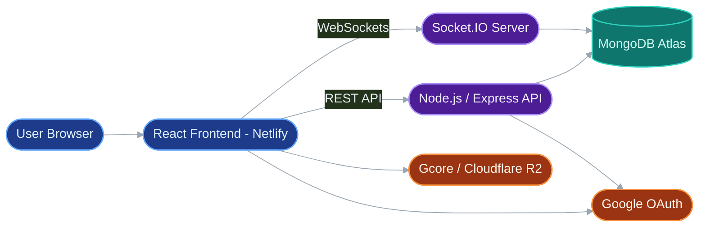
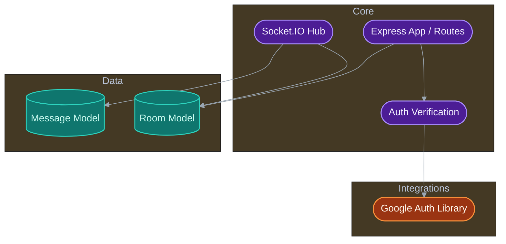
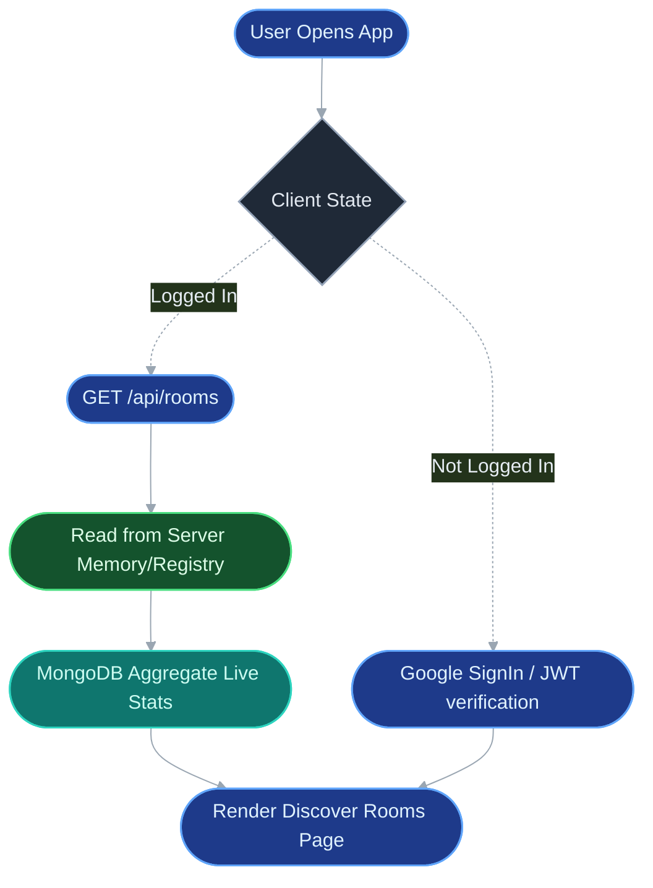

# Real-Time Chat App v1.4.0

A real-time chat application built with the **MERN** stack (**MongoDB**, **Express**, **React**, **Node.js**) and **Socket.IO**.

---

## 🚀 Core Features
- Real-time communication using WebSockets (Socket.IO)
- Frontend built with **React**
- Backend powered by Node.js and Express
- Can be accessed globally using **ngrok**

---

## 📂 Project Structure

```yaml
📦Real-Time-Chat-App/
┣ 📂client/              # React frontend application
┃ ┣ 📂public/            # Public assets (icons, index.html)
┃ ┣ 📂src/               # React source code
┃ ┣ 📜package.json       # Frontend dependencies
┃ ┗ ...
┣ 📂server/              # Node.js backend application
┃ ┣ 📂models/            # Mongoose schemas (Message.js, Room.js)
┃ ┣ 📜index.js           # Main server file (Express, Socket.IO)
┃ ┣ 📜package.json       # Backend dependencies
┃ ┗ ...
┣ 📜.env                 # Environment variables (MONGO_URI, etc.)
┣ 📜.gitignore           # Git ignore rules
┣ 📜package.json         # Root package with dev scripts
┣ 📜pnpm-lock.yaml       # PNPM lock file
┗ 📜README.md            # This file
```
---

## 🖥️ Run Locally
1. **Clone & Install**
   Clone the repo and install all dependencies from the root directory:
   ```bash
   git clone https://github.com/Harsh-Bajpai-1194/Real-Time-Chat-App.git
   cd Real-Time-Chat-App
   pnpm install
   ```

2. **Set Up Environment**
   Create a `.env` file in the root directory and add your variables. This file is used by the server.
   ```
   # For the React frontend (must start with REACT_APP_)
   REACT_APP_GOOGLE_CLIENT_ID=your_client_id
   MONGO_URI=your_mongodb_connection_string
   ADMIN_EMAIL=your_admin_email@gmail.com
   PORT=7777
   ```

3. **Run the App**
   Start both the client and server concurrently from the root directory:
   ```bash
   pnpm run dev
   ```

4. **Access the App**
   - The React frontend will be available at `http://localhost:3000`.
   - The Express backend will be running on `http://localhost:7777`.

---

## ⚡ Tech Stack
- **Frontend**: React
- **Backend**: Node.js, Express
- **Database**: MongoDB (with Mongoose)
- **Real-Time**: Socket.IO

---

## 📌 Notes
- GitHub Pages can only host static frontend files.  
- The backend (`server/index.js`) must be running locally or on a hosting service (ngrok, Render, Railway, etc.).  
- For a permanent public app, consider deploying the backend on **Render**, **Heroku**, or **Railway**.

---

## 6. System Architecture

### High-Level System



### Backend Component View



### Real-Time Chat Pipeline

```mermaid
%%{init: {"theme": "base", "themeVariables": {"background": "#0b1020", "primaryColor": "#1b2333", "primaryBorderColor": "#3a4a66", "primaryTextColor": "#e6edf3", "lineColor": "#9aa6b2"}, "flowchart": {"curve": "basis"}}}%%
flowchart LR
  UI([User Input]) --> E([Socket Emit: 'chat message'])
  E --> S([Backend Socket Listener])
  S --> DB[(Save to MongoDB Atlas)]
  DB --> B([Broadcast to Room])
  B --> O([Update Other Clients' UI])

  classDef frontend fill:#1e3a8a,stroke:#60a5fa,color:#e0f2fe,stroke-width:1.5px;
  classDef compute fill:#78350f,stroke:#f59e0b,color:#fef3c7,stroke-width:1.5px;
  classDef database fill:#0f766e,stroke:#2dd4bf,color:#ccfbf1,stroke-width:1.5px;

  class UI,E,O frontend;
  class S,B compute;
  class DB database;
```



### Room & Memory Lifecycle



---

## 7. Core Pipelines

* **Chat pipeline:**
1. User authenticates via Google OAuth; frontend retrieves token.
2. Token is verified by backend `/api/auth/google`.
3. Client connects to Socket.IO using standard WebSocket tunneling.
4. User joins a room -> `Room` model updates unique member list (`$addToSet`).
5. User sends message -> Saved durably into MongoDB `Message` model.
6. Server broadcasts message event exclusively to connected users in that specific socket room.

* **Asset pipeline:**
* Audio files (sound effects for chat events) bypass the backend entirely and are fetched directly from a custom CDN (Gcore / Cloudflare R2) to reduce Node.js bandwidth overhead.

* **Routing & Deployment:**
* Frontend static assets are deployed globally on Netlify.
* Backend is deployed on an AWS EC2 instance managed by `pm2` (or PaaS like Render), bridged to Netlify via proxy `_redirects` for URL masking and seamless CORS handling.

